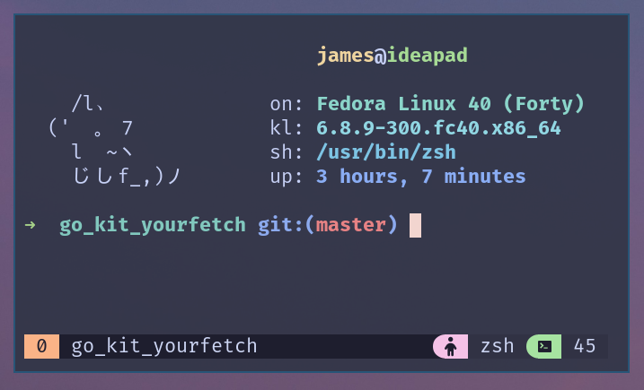
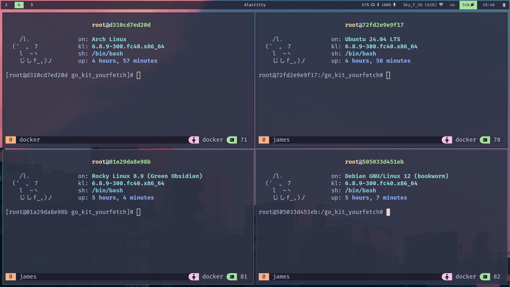

## GO KIT YOURFETCH! 


## Wow a cat themed - catppuccin system fetch program, kinda original...
I know, right? But you know, sometimes you need to do things by yourself instead of relying on pre-written (probably better-written) utils.

## Does it work only with that ASCII art logo?
yup, but one can decide to scale the program in order to support taller ascii art.
Reading comments should be enough to figure it out how to. You can always open an issue tho!

## Does it support real images?
unfortunately not, i wrote it for alacritty that does not support real images visualization.

## Will it work on my distro?
it should, i tested it in some barebone containers, but i did not tested it on my others machines yet. 

(yeah i know i could have used tmux instead of 4 instances of alacritty, but those sexy gaps...)

## Will it work on [pick name] OS?
I don't think so, this is a gnu+linux utility, it wont surely work on windows, and probably won't work on osx either (of course not without any tweaking)

## Can i use it on ARM?
Unfortunately i did not tested it on any arm device, but you could give it a shot and let me know!

## Can i use a different colorscheme? 
You can, but you need to modify the code youself and swap all the constants with ansi escape codes, it can be modularized to read those constants from a json or a txt tho, i'm just too lazy to do it right now. Shoulde be a nice TODO [ ] tho.

## So... how do i use it?
You can:
    - build it from source 
    - pick up a release

if you build from source you'll need:
    - go [version > 18]

if you download the release just run it with:
```shell
./gokityf
```
(be sure you have execute rights on it, else chmod +x gokityf)
NOTE: you need cat2.txt in the same folder as the executable

If you want to launch it from any other folder you'll need a script:
```run.sh```
```shell
    cd path/to/executable_and_txt_logo
    ./gokityf
```
```shell
chmod +x run.sh
```
```shell
./run.sh
```

in order to build (you can decide the building flags):
```shell 
git clone https://github.com/neoSnakex34/go_kit_yourfetch

cd go_kit_yourfetch

go build main.go

```
then run with:
```shell
./main

```


if you just want to test it:
```shell
git clone https://github.com/neoSnakex34/go_kit_yourfetch

cd go_kit_yourfetch

go run main.go
```
